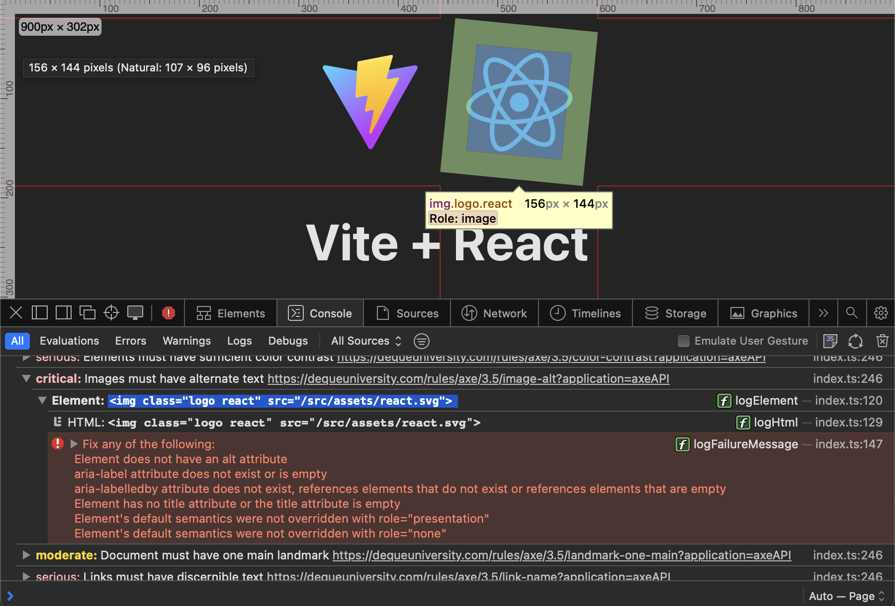
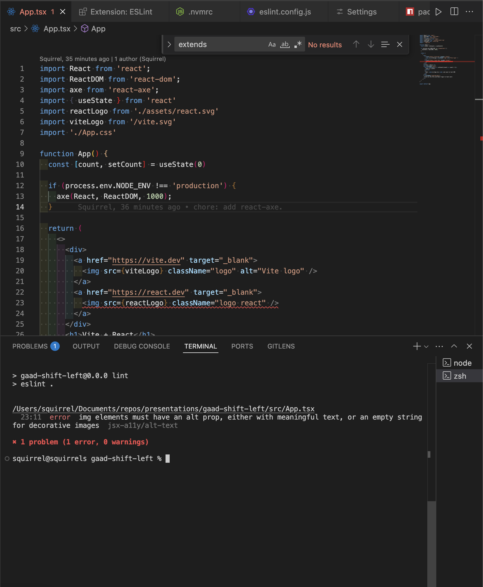

# React + TypeScript + Vite

This template provides a minimal setup to get React working in Vite with HMR and some ESLint rules.

Currently, two official plugins are available:

- [@vitejs/plugin-react](https://github.com/vitejs/vite-plugin-react/blob/main/packages/plugin-react) uses [Babel](https://babeljs.io/) for Fast Refresh
- [@vitejs/plugin-react-swc](https://github.com/vitejs/vite-plugin-react/blob/main/packages/plugin-react-swc) uses [SWC](https://swc.rs/) for Fast Refresh

## A11Y

- [react-axe](https://github.com/dequelabs/react-axe)
  - 
- [eslint-plugin-jsx-a11y](https://github.com/evcohen/eslint-plugin-jsx-a11y)
  - 

## Reference
- [Accessibility audit with react-axe and eslint-plugin-jsx-a11y](https://web.dev/articles/accessibility-auditing-react)
